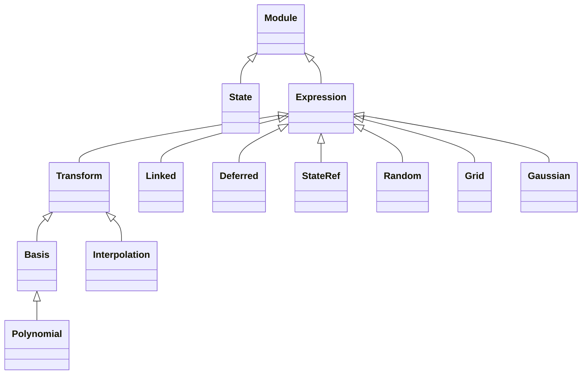

# Zodiax numerics: package summary and basic API

Zodiax numerics represents numerical definitions as ordinary Equinox PyTrees.
Array leaves remain optimisable, while the surrounding objects describe how those
arrays are transformed, shared, generated, converted, or read from running state.

Optional numerical inputs default to `None` and disappear from ordinary Equinox
prints. The resulting objects remain inspectable, serialisable, and addressable with
normal Zodiax paths and aliases.

## 1. High-level evaluation

### Expressions describe numerical operations

An `Expression` is an unrealised numerical value. It may hold a value to evaluate
later, define an operation to apply to a supplied value, or require named context at
evaluation time.

Most array-to-array expressions are `Transform` objects. Their common numerical
input is named `x`.

```python
import jax.numpy as np
import jax.random as jr
import zodiax as zdx

latent = np.array([-1.0, 0.0, 1.0])

definition = zdx.Exp(x=latent)
print(definition)
```

```text
Exp(x=f32[3])
```

Because `x` is stored, an empty call and `resolve()` both produce the array:

```python
value = definition()
value = definition.resolve()
```

A transform with no stored `x` is a reusable operation:

```python
transform = zdx.Exp()
print(transform)
value = transform(latent)
```

```text
Exp()
```

These forms are equivalent:

```python
zdx.Exp()(latent)
zdx.Exp(x=latent)()
zdx.Exp(x=latent).resolve()
```

`evaluate()` and `fwd()` are subclass extension methods. Application code normally
uses calls and `resolve()`.

### Composition is ordinary nesting

Expressions compose by storing another expression in `x`:

```python
operation = zdx.Exp(
    x=zdx.Mul(
        x=zdx.Add(b=offset),
        s=scale,
    )
)

print(operation)
value = operation(latent)
```

```text
Exp(
  x=Mul(
    x=Add(b=f32[]),
    s=f32[]
  )
)
```

The supplied `latent` replaces the deepest undefined `x`, giving:

```text
latent -> Add(offset) -> Mul(scale) -> Exp -> value
```

Binding that deepest value instead produces a persistent numerical definition:

```python
definition = zdx.Exp(
    x=zdx.Mul(
        x=zdx.Add(x=latent, b=offset),
        s=scale,
    )
)

value = definition.resolve()
```

Resolution is recursive. Named context is passed through the complete chain and is
available to every expression that requires it.

### `Map` is the common linear composition

`Map` collects scale, matrix multiplication, and bias into the fixed operation

```text
y = matmul(s * x, M) + b
```

```python
mapping = zdx.Map(s=scale, M=matrix, b=offset)
value = mapping(latent)

definition = zdx.Map(x=latent, s=scale, M=matrix, b=offset)
value = definition.resolve()
```

Any of `s`, `M`, or `b` may be omitted, in which case that part is the identity.

## 2. Nested models and aliases

Aliases give short semantic names to nested structural paths without duplicating
leaves or introducing another parameter graph:

```python
class Model(zdx.Module):
    output: object

    def __init__(self, output, *, alias=None):
        self.output = output
        self.alias = alias


model = Model(
    output=zdx.Exp(
        x=zdx.Mul(
            x=zdx.Add(x=latent, b=offset),
            s=scale,
        )
    ),
    alias=(('log_latent', 'output.x.x.x'),),
)

model.log_latent
model = model.set(log_latent=new_latent)
```

Aliases are static constructor metadata. They are validated during construction
and loading, may target nested dynamic fields, and cannot collide with an existing
field, property, method, or another alias. They print only when supplied.

## 3. Runtime resolution

Some values can only be evaluated where their owning object receives authoritative
runtime context. A sampled stage, for example, may require the coordinates of the
particular input currently reaching it. Resolving every stage from one root-level
`coords` value would use the wrong coordinate system.

Runtime dependence is therefore declared by the field owner rather than by the
expression type:

```python
class Stage(zdx.Module):
    response: object = zdx.field(runtime=True)
    gain: object

    def __init__(self, response, gain, *, alias=None):
        self.response = response
        self.gain = gain
        self.alias = alias

    def __call__(self, coords, **context):
        realised = self.resolve(
            runtime=True,
            coords=coords,
            **context,
        )
        return realised.gain * realised.response


stage = Stage(
    response=zdx.Gaussian(cov=np.eye(2)),
    gain=2.0,
)
```

Normal resolution treats every `runtime=True` field in the selected tree as an
opaque subtree:

```python
context_resolved = stage.resolve()
```

The owning stage unlocks that field only after its local coordinates exist:

```python
value = stage(coords)
```

The protected expression may require both runtime and higher-level context. The
stage passes both together, so its complete expression is evaluated coherently at
the runtime boundary. Protected subtrees are not partially evaluated beforehand.

For a model whose protected fields genuinely share one runtime context, an explicit
high-level override is available:

```python
realised = stage.resolve(
    runtime=True,
    coords=coords,
)
```

This override is deliberate: `runtime=True` removes runtime protection throughout
the selected tree.

## 4. Model terminology and lifecycle

The numerical model has four useful forms:

| Form | Meaning |
|---|---|
| **Unrealised model** | Canonical user-facing and serialised model containing arrays, expressions, `Linked`, and `Deferred` values. |
| **Linked model** | Ephemeral result of `populate()` in which shared values are connected. Expressions remain. |
| **Context-resolved model** | Available high-level context has been resolved, while protected runtime fields may remain unrealised. |
| **Realised model** | No numerical-definition objects remain; the model has concrete array-valued leaves. |

```text
unrealised model
      | populate()
      v
 linked model
      | resolve(high-level context)
      v
context-resolved model
      | owner resolves runtime fields
      v
 realised model
```

The unrealised model is the durable object normally edited, optimised, and
serialised. The other forms are ephemeral evaluation views. In a sequential model,
individual stages may create local realised copies internally without constructing
one globally realised model.

Population and resolution remain separate. `populate()` needs the complete link
ownership scope, whereas runtime resolution often belongs to a much smaller local
scope.

## 5. Package structure

The public classes are re-exported from `zodiax`, so normal use is `zdx.Map`,
`zdx.State`, `zdx.Grid`, and so on.

```text
zodiax/numerics/
├── expressions.py
│   └── Expression
├── transforms.py
│   ├── Transform
│   ├── Add, Mul, Pow
│   ├── Exp, Log, Exp10, Log10
│   └── MatMul, Mask, Map
├── normalisation.py
│   ├── Norm
│   └── MeanNorm, RMSNorm, SumNorm
├── units.py
│   └── Unit
├── links.py
│   └── Linked, Deferred
├── state.py
│   └── State, StateRef
├── random.py
│   └── Random
├── grids.py
│   └── Grid
└── parametric/
    ├── Basis
    ├── Polynomial
    ├── Gaussian
    └── Interpolation
```

The inheritance structure is deliberately shallow:



## 6. Core transformations

### Reversible transforms

Exact transforms expose `inv()`:

```python
transform = zdx.Exp(base=10.0)
value = transform(latent)
recovered = transform.inv(value)
```

Nested reversible transform chains support `decode()` and `encode()`:

```python
transform = zdx.Exp(x=zdx.Add(b=offset))
value = transform.decode(latent)
recovered = transform.encode(value)
```

Rank-deficient operations such as `MatMul` and `Mask` expose a representative
reverse operation through `solve()` and `project()` rather than claiming a unique
inverse.

### Units

`Unit` is a reversible scale transform:

```python
conversion = zdx.Unit('mm', to='m', x=distance)
distance_m = conversion.resolve()

distance_m = zdx.Unit('mm', to='m')(distance_mm)
distance_mm = zdx.Unit('mm', to='m').inv(distance_m)
```

When `to` is omitted, the object captures the active global output unit for its
category at construction:

```python
zdx.set_units({'cartesian': 'um', 'angular': 'mas'})

distance = zdx.Unit('mm', x=2.0)
distance_um = distance.resolve()
```

Existing objects retain their stored output unit if the global registry later
changes.

### Normalisation

`MeanNorm`, `RMSNorm`, and `SumNorm` scale an array to target `s`, which defaults to
one:

```python
mean_one = zdx.MeanNorm(x=field)
unit_rms = zdx.RMSNorm(x=field)
unit_sum = zdx.SumNorm(x=field)

target_rms = zdx.RMSNorm(x=field, s=target, w=support)
```

`w` is an optional nonnegative weight or support mask. `axis=None` operates over the
complete array and disappears from the print. Explicit axes are an advanced
override.

### Masks

`Mask` stores compact values and scatters them into a fixed output shape:

```python
mask = np.array([True, False, True, False])
definition = zdx.Mask(mask, x=np.array([2.0, 5.0]))

full = definition.resolve()       # [2, 0, 5, 0]
compact = definition.solve(full)  # [2, 5]
```

The selected indices and output shape are static, while the compact values remain
ordinary optimisable leaves.

## 7. Shared definitions

`Linked` owns a numerical definition once. `Deferred` stores only the same static
identity and is connected by `populate()`:

```python
shared = zdx.Linked(2.0, key='shared-scale')

model = Model(
    output=zdx.Add(
        x=zdx.Mul(x=input_value, s=shared),
        b=shared.defer(),
    )
)

linked = model.populate()
realised = linked.resolve()
```

```text
Linked(key='shared-scale', value=f32[])
Deferred(key='shared-scale')
```

The unrealised model contains the dynamic value only at its `Linked` owner. The
linked execution copy routes every use back to that owner, so gradients accumulate
onto the same original leaf.

## 8. Running state and random values

### State and references

`State` owns named running values as an immutable Zodiax PyTree. `StateRef` contains
only a static path. It is an `Expression`, so it can occupy any numerical leaf and
defer reading the corresponding value until the surrounding definition is resolved:

```python
state = zdx.State(
    index=0,
    time=0.0,
    dt=0.1,
    key=jr.key(0),
)

time = state.ref('time')

scheduled = zdx.Add(
    x=zdx.Mul(
        x=time,
        s=2.0,
    ),
    b=1.0,
)

print(state)
print(time)
print(scheduled)
```

```text
State(dt=f32[], index=i32[], key=key<fry>[], time=f32[])
StateRef(path='time')
Add(
  x=Mul(
    x=StateRef(path='time'),
    s=f32[]
  ),
  b=f32[]
)
```

The stored definition has no copy of the time value. Resolution recursively reaches
the `StateRef`, reads `state.time`, and continues evaluating the outer transforms:

```python
current = scheduled.resolve(state=state)  # 1.0

state = state.step()
following = scheduled.resolve(state=state)  # 1.2
```

The same unrealised `scheduled` expression is reused for both evaluations. Only the
separately carried State changes. `StateRef` therefore behaves like any other nested
expression while keeping mutable-in-time values out of the model definition.

Despite the general idea of deferred evaluation, `StateRef` and `Deferred` have
different roles: `StateRef` reads call-local State, while `Deferred` is a key-only
reference populated from a `Linked` owner.

State uses the normal Zodiax `set()` path API. Updates preserve the PyTree topology
and the shape, dtype, and weak type of every carried leaf, matching the requirements
of JAX compiled loops.

`step()` advances whichever conventional position values exist:

```python
next_state = state.step()
```

```text
next_state.index = state.index + 1
next_state.time  = state.time + state.dt
next_state.key   = state.key
```

The key is a stable root rather than a changing key chain. An explicit
`state.step(dt=...)` overrides the stored `dt` for one transition.

### Generic JAX-random expressions

`Random` wraps any JAX-style callable whose first positional argument is a PRNG
key. It avoids a separate Zodiax class for every distribution:

```python
noise = zdx.Random(
    jr.normal,
    shape=(4,),
    stream='sensor-noise',
)

print(noise)
sample = noise.resolve(state=state)
```

```text
Random(fn='normal', shape=(4,), stream='sensor-noise')
```

Internally, `Random` uses ordinary `jr.fold_in` calls:

```text
state.key + state.index + random.stream -> ordinary JAX key -> fn(...)
```

Different `Random` objects receive independent generated stream identities by
default. Supplying a semantic `stream` preserves the same stream across separately
constructed definitions. The stream is static and serialised; no custom PRNG or key
type is introduced.

Common JAX trace-time options such as `shape`, `dtype`, and `axis` are stored as
static metadata automatically. A custom key-first callable can identify another
named trace-time option with `static='option'`; its numerical arguments remain
ordinary array leaves.

`key` and `index` can also be stored explicitly for a self-contained random
definition:

```python
noise = zdx.Random(
    jr.uniform,
    key=jr.key(3),
    index=0,
    shape=(4,),
)

sample = noise.resolve()
```

When State provides a key but no index, index zero is used and repeated resolution
produces the same fixed realisation. `State.step()` therefore requires an index or
time to advance; it never mutates the root key.

Common JAX random callables are serialisable directly. Custom key-first callables
can use the normal `register_callable()` mechanism.

## 9. Coordinate grids

`Grid` produces regular Cartesian coordinate arrays from sample counts `n`, spacing
`d`, and optional centre `c`:

```python
grid = zdx.Grid(n=(64, 96), d=(0.1, 0.2))
coords = grid.resolve()
```

```text
Grid(n=(64, 96), d=f32[2])
coords.shape == (2, 64, 96)
```

Grid uses `ij` indexing: coordinate component `i` varies along sampled array axis
`i`. The same convention works for one, two, or more dimensions.

The optional `unit` applies one conversion to both `d` and `c`. A string uses the
active global output for its category, while a `Unit` object selects an explicit
output:

```python
grid = zdx.Grid(n=(64, 64), d=0.1, unit='mm')

grid = zdx.Grid(
    n=(64, 64),
    d=0.01,
    unit=zdx.Unit('arcsec', to='mas'),
)
```

## 10. Parametric extensions

The `parametric` package contains reusable extensions of the core expression and
transform protocols.

### Basis

`Basis` contracts trailing coefficient dimensions against leading sampled-basis
dimensions:

```python
field = zdx.Basis(M=modes, x=coefficients)
value = field.resolve()
```

```text
coefficients.shape = (..., *coefficient_shape)
modes.shape        = (*coefficient_shape, *output_shape)
field.shape        = (..., *output_shape)
```

The default finds one unique matching coefficient shape. The advanced `axes=`
override is needed only when several matches are possible. Matrix-free or separable
bases can specialise the calculation without materialising `M`.

### Polynomial

`Polynomial` stores its exponent array and generates terms from coordinates:

```python
polynomial = zdx.Polynomial(degree=2, ndim=2, x=coefficients)
surface = polynomial.resolve(coords=coords)
```

```text
Polynomial(x=f32[6], p=i32[2,6])
```

### Gaussian

`Gaussian` is the general covariance-defined profile:

```python
profile = zdx.Gaussian(cov=covariance)
values = profile.resolve(coords=coords)
```

Its dimensionality follows the final square covariance axes, while its coordinates
follow the same component-first `ij` convention as `Grid`.

### Interpolation and parametric state

`Interpolation` follows the ordinary transform protocol. Its query `x` may be an
array, a supplied transform input, or another expression. A `StateRef` makes a
sampled history state-dependent without giving interpolation its own state API:

```python
state = zdx.State(time=0.0, dt=0.1)

coefficients = zdx.Interpolation(
    knots=times,
    values=samples,
    x=state.ref('time'),
)

field = zdx.Basis(M=modes, x=coefficients)
value = field.resolve(state=state)
state = state.step()
```

The same reference protocol can select a time, index, key, or any other array-valued
State entry. Interpolation only consumes the resulting query array and remains
independent of how it is stored or advanced.
