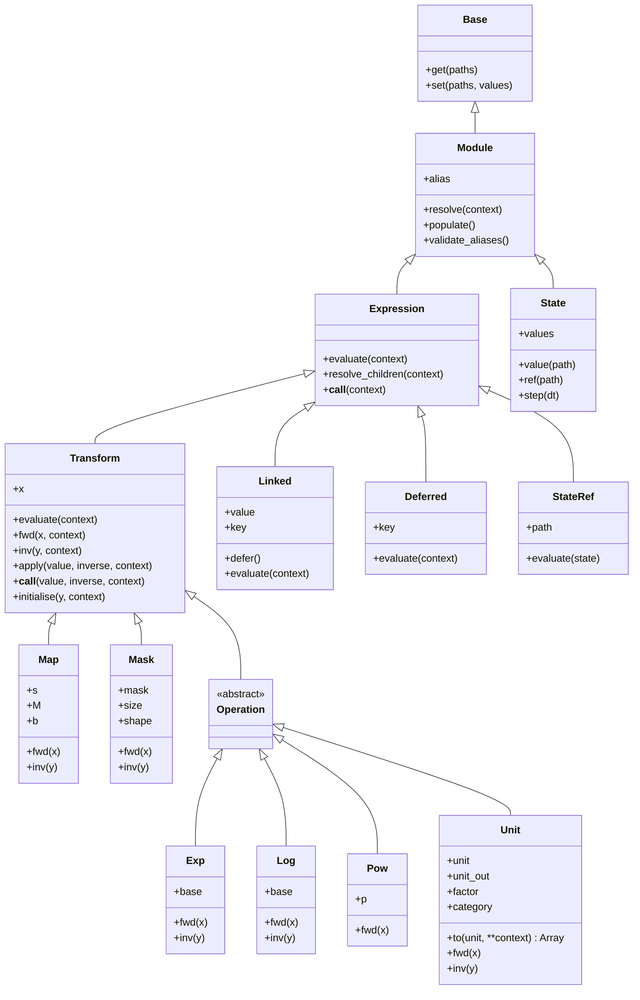

# Numerics design

## Principles

1. A numerical definition is an ordinary Equinox PyTree. Parameter arrays remain
   accessible by paths and aliases for editing and differentiation.
2. `resolve()` prepares definitions and automatically connects shared values.
   Calling an expression resolves it; a transform call may supply an explicit input.
3. `Map` combines scale, matrix or basis contraction, and bias. Nest transforms only
   when a calculation needs a different order or a nonlinear operation.
4. `Operation` groups elementwise transforms under the common Transform interface.
   Domain-specific parameterisations belong downstream as Expressions.
5. Aliases provide concise names for existing structural paths without duplicating
   parameter leaves or introducing another parameter graph.
6. Optional numerical operands default to `None` and disappear from Equinox's
   ordinary representation.
7. An expression's calculation controls which operands and local context it needs.
   If it cannot finish, available descendants still prepare.
8. Model definitions remain reusable while explicit State carries time, iteration,
   and other current numerical values.

## Object model

The tree below includes every public numerical class. Methods shown on a parent
are inherited by its children; concrete transforms supply their local formula.



Here `context` abbreviates named scientific inputs passed as `**context`;
`inverse` is the optional keyword argument on `apply` and explicit calls.

A Module contains definitions and resolves to a prepared copy of its own class. An
Expression represents a value: it resolves to its result when ready, or a partially
prepared Expression when an input is unavailable. State is an ordinary Module of
current numerical arrays; expressions belong in the model.

`base.py` owns Base's general path operations. `module.py` owns Module, canonical
aliases, raised lookup, and multi-model updates. Equinox integration wrappers
remain in `base.py`. These classes remain available through the package root.

`Map` evaluates `y = matmul(s * x, M) + b`. Omitted operands skip their stage.
Scale and bias may
broadcast without expanding the relevant input/output shape. The public `matmul`
function contracts the final input axis with the first matrix or basis axis.

Operation subclasses use ordinary JAX broadcasting, including shape expansion.
Available inverses apply elementwise on valid domains and retain the broadcasted shape;
they do not infer or restore a smaller original shape. Mask scatters compact values
using a dynamic boolean mask with a fixed selected count. Construct Mask before
entering JIT to determine that count. Dynamic execution computes its indices with
work proportional to the number of mask elements.

## Evaluation and reverse operations

`evaluate(**context)` implements one expression's calculation. Transform's inherited
`evaluate` resolves its stored `x` and calls `fwd(x, **context)`. Required context is
declared in `evaluate`, or in `fwd` for a Transform subclass.

`transform(x)` and `transform.apply(x)` follow the complete nested Transform chain
stored in `x`. An explicit input overrides the deepest stored value. `transform()`
and `transform.resolve()` instead evaluate the stored definition.

`fwd` and `inv` are local numerical operations on prepared arrays.
`apply(value, inverse=True)` follows the chain backwards using `inv`;
`transform(value, inverse=True)` is the same operation. Keep `inverse` a Python
boolean fixed during JAX tracing. Exp, Log, and Unit provide inverses on their
numerical domains. Pow is forward-only. Map and Mask provide representative
reverses: Map subtracts bias, applies a matrix pseudoinverse using JAX's native
rank cutoff, and divides by scale; Mask gathers selected entries. These reverses
need not recover arbitrary inputs or outputs exactly.

The advanced `initialise(y)` helper binds the recovered deepest input in a new
definition. It cannot bind through a non-Transform Expression such as a StateRef
or Linked owner; update that original definition instead.

`resolve` tries an expression's calculation before preparing its children, allowing
that calculation to choose local context and required operands. Missing context or
a requested unresolved numerical operand falls back to child preparation. Ordinary
Modules may retain expressions for their own later calls. Other errors propagate.

Each context name has one scientific meaning throughout the tree. Incoming
`coordinates` and a child's derived `basis_coordinates` must have distinct names;
successive derived frames need further distinct names. The fallback forwards supplied
context unchanged and cannot infer coordinate frames from arrays.

## Sharing, state, and units

Normal resolution collects Linked owners before replacing them and their Deferred
references. Each key has one owner in the supplied tree; additional uses are references.
Population supports nested owners and PyTree values and rejects invalid link topology.
Run resolution inside a differentiated function so all uses contribute to the original
owner's gradient. `populate` is an advanced structural-only operation;
`resolve(populate=False)` skips that stage when the caller has already performed it.
Population covers the tree supplied to outer resolution. Explicit transform calls
with references across operands use an operator prepared by resolving the complete
unbound operator or its containing Module first.

State converts each named entry to one numerical array at construction. StateRef
stores a path and reads from the State supplied during resolution. Inherited `set`
does not convert replacements; callers preserve shapes, dtypes, and tree structure
for JAX loop carry. `step` reads the original index and time before applying their
updates together, leaving random keys and other entries unchanged.

Unit stores an input `unit` and optional `unit_out`. With `unit_out=None`, eager
evaluation follows the current global convention; an explicit `to` fixes the target.
`to(unit, **context)` resolves the stored input and returns a converted array,
leaving the original definition unchanged. `to(None)` uses the current global
convention. An absent input or missing context raises `ValueError`. JIT captures
global settings when tracing; cached compiled calculations retain that convention.
Explicit-unit conversion helpers remain independent of global settings.

## Developer contracts

The [walkthrough's contract tables](numerics.md#12-developer-contracts) map these
behaviours to the six focused test files in `tests/numerics/`.

- Convert numerical inputs at visible boundaries with `as_array`. Generic boundaries
  retain inferred types; explicit `float`, `int`, `complex`, or `bool` requests use
  JAX's configured default precision. None and Expressions pass through unchanged.
- Expression calculations are pure and explicitly resolve the operands they use.
  Unused expression fields do not block evaluation. Available descendants remain
  prepared if a parent must defer; the original definition is unchanged.
- Temporary expression bookkeeping belongs to one outer resolution call, with
  result reuse limited to identical objects in the same JAX trace. Scientific context
  remains explicit in method arguments.
- Constructors establish structural contracts. Numerical execution uses ordinary
  Python/JAX errors and numerical behaviour, without runtime validation callbacks.
- Module aliases refer to structural topology. Resolving or replacing a subtree may
  invalidate a target; `validate_aliases` checks it explicitly. Module construction
  rejects dots in mapping keys because dots separate path segments. Inherited `set`
  does not repeat constructor validation; callers supply valid replacements.

## Package structure

The numerical implementation is split by responsibility. Domain-specific profiles
and sampled bases are downstream Expressions, as illustrated in the
[walkthrough](numerics.md#9-a-gaussian-expression).

```text
src/zodiax/
├── __init__.py
├── base.py
├── module.py
├── optimisation.py
├── stats.py
├── numerics/
│   ├── __init__.py
│   ├── arrays.py
│   ├── expressions.py
│   ├── links.py
│   ├── operations.py
│   ├── state.py
│   ├── transforms.py
│   ├── units.py
│   └── overview.md
├── derivatives/
└── serialisation/
```

| Numerical module | Public responsibilities |
|---|---|
| `arrays.py` | `as_array` conversion |
| `expressions.py` | `Expression` and tree resolution |
| `links.py` | `Linked`, `Deferred`, structural population, and link checks |
| `transforms.py` | `Transform`, `Map`, `Mask`, and `matmul` |
| `operations.py` | `Operation`, `Exp`, `Log`, and `Pow` |
| `state.py` | `State`, `StateRef`, and reference checks |
| `units.py` | `Unit`, unit conventions, and conversion helpers |
