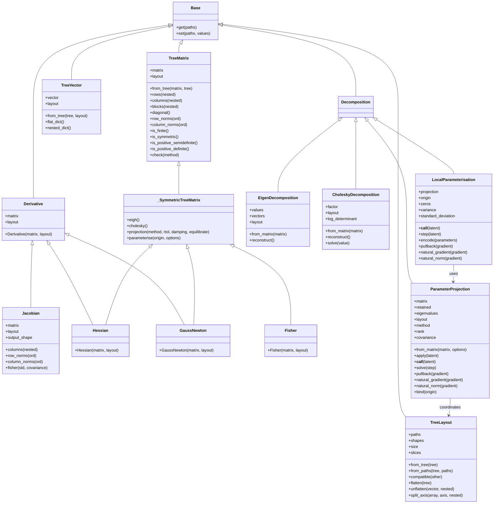

# Zodiax derivatives overview

Zodiax calculates derivatives from a parameter dictionary and returns numerical
objects that retain the parameter names and shapes.

## 1. Define a prediction and calculate its derivatives

A small linear model illustrates the prediction, residual, and loss functions used by the three derivative calculations.

```python
import equinox as eqx
import jax
import jax.numpy as np
import zodiax as zdx


class Linear(zdx.Module):
    slope: jax.Array
    offset: jax.Array

    def __call__(self, x):
        return self.slope * x + self.offset


parameters = {"slope": np.array(2.0), "offset": np.array(0.0)}
linear = Linear(slope=parameters["slope"], offset=parameters["offset"])
coordinates = np.array([-1.0, 0.0, 1.0])
observations = np.array([-1.0, 1.0, 3.0])
noise = 0.5


def prediction(values):
    updated = linear.set(values)
    return updated(coordinates)


def residuals(values):
    return prediction(values) - observations


def loss(values):
    standardised = residuals(values) / noise
    return 0.5 * np.sum(standardised**2)
```

`prediction` updates a copy of `linear` from the supplied dictionary. Pass that
same parameter dictionary to each derivative function:

```python
J = zdx.jacobian(prediction, parameters)
H = zdx.hessian(loss, parameters)
G = zdx.gauss_newton(residuals, parameters, std=noise)
print(linear)
print(J)
print(H)
print(G)
print(J.matrix)
print(H.matrix)
print(G.matrix)
```

```text
Linear(slope=weak_f32[], offset=weak_f32[])
Jacobian(
  matrix=f32[3,2], layout=TreeLayout(paths=('offset', 'slope'), shapes=((), ()))
)
Hessian(
  matrix=f32[2,2], layout=TreeLayout(paths=('offset', 'slope'), shapes=((), ()))
)
GaussNewton(
  matrix=f32[2,2], layout=TreeLayout(paths=('offset', 'slope'), shapes=((), ()))
)
[[ 1. -1.]
 [ 1.  0.]
 [ 1.  1.]]
[[12.  0.]
 [ 0.  8.]]
[[12.  0.]
 [ 0.  8.]]
```

| Result | Meaning |
|---|---|
| Jacobian | Change in each prediction with each parameter |
| Hessian | Exact second derivatives of the scalar loss |
| GaussNewton | Curvature approximation from the individual residuals |

Hessian and Gauss–Newton agree for this linear least-squares problem. For nonlinear
predictions, Gauss–Newton omits residual second derivatives. Use the complete
scalar loss with `hessian` when those terms matter; `gauss_newton` takes unreduced
residuals, not a sum of squared residuals.

TreeLayout in the printed objects is internal bookkeeping for parameter names and
shapes. The examples use JAX's default precision and floating trainable parameters.

## 2. Use the curvature for factors and parameter steps

Decompositions reuse the calculated Hessian to describe local parameter changes.

```python
eigen = H.eigh()
cholesky = H.cholesky()
projection = H.projection(method="cholesky")
print(eigen)
print(cholesky)
print(projection)
assert np.allclose(eigen.reconstruct().matrix, H.matrix)
assert np.allclose(cholesky.reconstruct().matrix, H.matrix)
```

```text
EigenDecomposition(
  values=f32[2],
  vectors=f32[2,2],
  layout=TreeLayout(paths=('offset', 'slope'), shapes=((), ()))
)
CholeskyDecomposition(
  factor=f32[2,2], layout=TreeLayout(paths=('offset', 'slope'), shapes=((), ()))
)
ParameterProjection(
  matrix=f32[2,2],
  retained=bool[2],
  eigenvalues=None,
  layout=TreeLayout(paths=('offset', 'slope'), shapes=((), ())),
  method='cholesky'
)
```

The eigen decomposition exposes eigenvalues and eigenvectors. Cholesky stores a
lower-triangular factor. The projection maps latent coordinates into parameter
steps, scaled by the local curvature. Cholesky requires positive definiteness;
the default eigen projection, `H.projection()`, also supports positive-semidefinite
matrices by discarding unresolved modes.

Bind the projection to the same parameter dictionary:

```python
geometry = projection.bind(parameters)
latent = np.array([1.0, 0.0])
trial_parameters = geometry(latent)
print(geometry)
print(trial_parameters)
print(prediction(trial_parameters))
assert np.allclose(geometry.encode(trial_parameters), latent)
```

```text
LocalParameterisation(
  projection=ParameterProjection(
    matrix=f32[2,2],
    retained=bool[2],
    eigenvalues=None,
    layout=TreeLayout(paths=('offset', 'slope'), shapes=((), ())),
    method='cholesky'
  ),
  origin={'slope': weak_f32[], 'offset': weak_f32[]}
)
{'offset': Array(0.28867516, dtype=float32), 'slope': Array(2., dtype=float32)}
[-1.7113248   0.28867516  2.288675  ]
```

`geometry.zeros` represents the original parameters. Calling `geometry(latent)`
adds the corresponding step and returns another parameter dictionary; `step(latent)`
returns only the change. `encode` recovers latent coordinates. The shortcut
`H.parameterise(parameters, method="cholesky")` constructs and binds the projection
in one call.

```python
gradient = jax.grad(loss)(parameters)
print(geometry.natural_gradient(gradient))
print(geometry.standard_deviation)
```

```text
{'offset': Array(-1.0000001, dtype=float32), 'slope': Array(0., dtype=float32)}
{'offset': Array(0.28867516, dtype=float32), 'slope': Array(0.3535534, dtype=float32)}
```

`natural_gradient` applies the represented inverse curvature to a gradient,
without choosing a sign or step size. Here the standard deviations have the local
Gaussian uncertainty interpretation. Discarded modes contribute zero to the
represented covariance; this does not mean an unconstrained parameter has zero
uncertainty. The [factor reference](decompositions.md) gives the equations,
rank-selection rules, and differentiation limits.

## 3. Inspect named results and Fisher information

The same derivative objects provide named parameter views and Gaussian Fisher information.

```python
print(J.columns()["slope"])
print(H.blocks()["offset"]["slope"])
F = J.fisher(std=noise)
print(F)
assert np.allclose(F.matrix, H.matrix)
```

```text
[-1.  0.  1.]
0.0
Fisher(
  matrix=f32[2,2], layout=TreeLayout(paths=('offset', 'slope'), shapes=((), ()))
)
```

`columns` groups sensitivities by parameter name, while `blocks` groups pairs of
parameters. Fisher information uses the model Jacobian and a Gaussian noise model;
its matrix agrees with the Hessian in this example.

## 4. Adjust noise and execution options

Noise arguments and column batching adapt the same calculation to the data and available memory.

```python
covariance = noise**2 * np.eye(observations.size)
weighted = zdx.gauss_newton(residuals, parameters, cov=covariance, nbatches=2)
assert np.allclose(weighted.matrix, G.matrix)

calculate = eqx.filter_jit(
    lambda values: zdx.hessian(loss, values, nbatches=2, checkpoint=True)
)
assert np.allclose(calculate(parameters).matrix, H.matrix)
```

Use `std` for independent noise, `cov` for covariance, or `inv_cov` for an existing
precision matrix; supply at most one. `J.fisher` calls its covariance argument
`covariance`. These describe fixed noise for the local derivative calculation.

`nbatches` is the number of sequential parameter-column blocks. More blocks reduce
simultaneous tangent storage, while the returned dense matrix keeps the same size.
`checkpoint=True` trades repeated computation for fewer saved intermediates.
Both Hessian methods are exact: `"fwd-rev"` is the default, and `"rev-fwd"` is an
alternative execution order.

If the prediction uses numerical Expressions or shared values, resolve the
containing model inside `prediction` so those parameters remain part of the
calculation. Returned derivative objects store arrays rather than executable
linearisation closures; recalculate them when the parameter point changes.

## 5. Developer reference

The structure and contract tables below define the implementation and test boundaries.

### 5.1. Package structure and classes

The package separates parameter layouts and results, derivative calculations, and reusable matrix factors.

```text
src/zodiax/derivatives/
├── __init__.py
├── containers.py       Layouts, vectors, matrices, Jacobian, curvature results
├── operations.py       jacobian, hessian, gauss_newton, hessian_to_pytree
├── decompositions.py   Eigen/Cholesky factors and local parameter coordinates
└── overview.md
```

Public names are available as `zdx.<name>`. Derivative groups Jacobian, Hessian, and
GaussNewton; Fisher uses the symmetric-matrix interface separately. Decomposition
groups the four factor and coordinate-map classes without imposing shared fields.
`_SymmetricTreeMatrix` is the internal implementation shared by symmetric results.



Tests live in `tests/derivatives/`: `test_containers.py` covers layouts and stored
results, `test_operations.py` derivative calculations, `test_decompositions.py`
matrix factors and coordinate maps, and `test_edge_cases.py` additional shape,
dtype, and transformation boundaries.

### 5.2. Layouts and realised data

Layouts describe coordinate structure; numerical containers own array conversion.

| Input or API | Output type and shape | Contract |
|---|---|---|
| `TreeLayout.from_tree(tree)` with real numerical leaves | TreeLayout | JAX leaf order; static paths/shapes; no stored values or dtype. |
| `TreeLayout.from_paths(tree, paths)` | TreeLayout | Explicit path order; unique selected leaves; dots delimit structural paths. |
| `layout.compatible(other)` | Python bool | Compare paths and shapes independently of values/dtypes. |
| `layout.flatten(tree)` | Floating Array `(n,)` | Selected shapes match; use configured default float. |
| `layout.unflatten(vector, nested=False/True)` | Flat/nested dictionary of Arrays | Restore leaf shapes, not original Module/list classes. |
| `layout.split_axis(a, axis)`, axis length `n` | Dictionary of Arrays | Replace that axis with each leaf shape; preserve other axes. |
| `Derivative(matrix, layout)` | Derivative with final axis `(n,)` | Shared stored-result fields; Jacobian, Hessian, and GaussNewton are Derivatives, Fisher is not. |
| `TreeVector(vector, layout)` | TreeVector, Array `(n,)` | Real array-like data convert to configured default float. |
| `TreeMatrix(matrix, layout)` | TreeMatrix, Array `(n, n)` | Both axes share the layout. |
| Zero-length numerical leaves in layouts/storage views | Zero-coordinate arrays and shaped views | Storage is allowed; derivative calculations and factorisation need `n > 0`. |
| Hessian/GaussNewton/Fisher construction | Same class, Array `(n, n)` | Symmetrise with `(matrix + matrix.T) / 2`; no spectrum check. |
| `matrix.blocks()` for leaf shapes `a`, `b` | Dictionaries of Arrays `a + b` | Scalar/scalar blocks have shape `()`. |
| Matrix diagonal and parameter-axis norms | TreeVector `(n,)` | Preserve parameter layout. |
| Inherited immutable `set` | New container | No constructor conversion/validation; supply valid replacements. |

```python
layout = zdx.TreeLayout.from_tree(parameters)
vector = zdx.TreeVector.from_tree(parameters)
assert J.matrix.shape == coordinates.shape + (layout.size,)
assert H.blocks()["offset"]["slope"].shape == ()
assert np.allclose(layout.flatten(layout.unflatten(vector.vector)), vector.vector)
```

### 5.3. Differentiation and weighting

Trainable parameters are floating leaves; noise defines a fixed weighting for the local derivative.

| Input or API | Output type and shape | Contract |
|---|---|---|
| `jacobian(f, x)`, floating `f(x)` shape `s` | Jacobian, Array `s + (n,)` | Flatten only parameter coordinates. |
| `hessian(f, x)`, floating scalar `f(x)` | Hessian, Array `(n, n)` | Exact second derivative; indefinite results allowed. |
| `gauss_newton(r, x)`, unreduced floating residual shape `s` | GaussNewton, Array `(n, n)` | `J_r.T @ W @ J_r`; scalar means one residual. |
| Parameter PyTree `x` | Same structure supplied to function | Dynamic leaves are floating; integers, booleans, complex values, and keys unsupported. |
| Real array-like noise inputs | Arrays in configured default float | Data conversion accepts integers; shapes and exclusivity are checked. |
| Positive `std`, broadcastable to `s` | Whitened derivative products | Divide before products; no dense diagonal covariance. |
| Covariance/precision `(m, m)`, `m = prod(s)` | Residual-space solve/product | Covariance positive definite; precision positive semidefinite; row-major order. |
| `J.fisher(std=... / covariance=...)` | Fisher, Array `(n, n)` | Gaussian, parameter-independent noise interpretation; preserve J's layout. |
| Static integer `nbatches` in `[1, n]` | Same dense numerical result | Sequential column blocks; final padding trimmed. |
| Static Hessian method `"fwd-rev"` / `"rev-fwd"` | Same exact Hessian | Required JAX derivative rules must exist. |

```python
reference = J.matrix.T @ J.matrix / noise**2
assert np.allclose(G.matrix, reference)
assert np.allclose(J.fisher(covariance=covariance).matrix, reference)
```

### 5.4. Decompositions and coordinate maps

Factorisation contracts distinguish matrix equations, coordinate conversions, and statistical interpretation.

| Input or API | Output type and shape | Contract |
|---|---|---|
| `Decomposition` family | EigenDecomposition, CholeskyDecomposition, ParameterProjection, LocalParameterisation | Common Base family, without a shared field or numerical-method requirement. |
| Nonempty symmetric result `.eigh()` | EigenDecomposition: `(n,)`, `(n, n)` | Ascending eigenvalues; column eigenvectors; indefinite allowed. |
| Positive-definite result `.cholesky()` | CholeskyDecomposition, factor `(n, n)` | Reconstruct `L @ L.T`; scalar log determinant. |
| `cholesky.solve(v)`, Array/TreeVector `(n,)` | TreeVector `(n,)` | Solve original matrix system; matching layout. |
| PSD result `.projection(method="eigh")` | ParameterProjection `(n, n)` | Optional equilibration; relative positive-mode threshold; zero discarded columns. |
| `.projection(method="cholesky")` | ParameterProjection `(n, n)` | Positive-definite damped matrix; retain all modes. |
| Nonempty zero metric, eigen method | Rank-zero ParameterProjection | `apply`, `solve`, and induced covariance return zeros. |
| Empty input to decomposition `from_matrix` / matrix factor methods | ValueError | Require at least one coordinate; this does not prohibit empty stored arrays. |
| `projection.apply(u)`, real flat `(n,)` | TreeVector `(n,)` | Parameter step `P @ u`; calling projection is equivalent. |
| `projection.solve(step)`, Array/TreeVector `(n,)` | Latent Array `(n,)` | Minimum-norm least-squares coordinates in retained columns; no second relative cutoff. |
| `projection.pullback(g)` | Array `(n,)` | `P.T @ g`, distinct from solving for coordinates. |
| `projection.natural_gradient(g)` / `natural_norm(g)` | TreeVector `(n,)` / scalar Array | `P @ P.T @ g` / `sqrt(g.T @ P @ P.T @ g)`. |
| `projection.bind(origin)` or `metric.parameterise(origin)` | LocalParameterisation | Origin paths and shapes match the metric layout. |
| `geometry(u)` / `geometry.step(u)` | PyTree of default-floating Arrays | `x0 + P @ u` / `P @ u`; preserve structure/static metadata. |
| `geometry.encode(x)` | Latent Array `(n,)` | Solve for coordinates of `x - x0`. |
| `geometry.variance` / `standard_deviation` | PyTree matching origin | Diagonal of induced covariance / its nonnegative square root; truncation does not establish certainty. |

```python
P = geometry.projection.matrix
assert np.allclose(P.T @ F.matrix @ P, np.eye(2))
assert np.allclose(P @ P.T, np.linalg.inv(F.matrix))
assert np.allclose(geometry.encode(parameters), geometry.zeros)
```

### 5.5. Transformations and validation

Numerical methods use ordinary JAX calculations; explicit diagnostics have separate execution boundaries.

| API or boundary | Output / behaviour | Contract |
|---|---|---|
| Matrix `is_*` diagnostics | Scalar boolean Array | Usable under JIT; definiteness tolerances explicit. |
| `check("eigh"/"projection"/"cholesky")` | Original object or exception | Eager decision from JAX scalar diagnostics; finite/symmetry/domain checks; never implicit. |
| JIT, checkpointing, batching, method options | Same promised numerical result | Static options; checkpointing changes storage/recomputation. |
| Differentiating realised arrays or a fixed coordinate map | Ordinary JAX derivatives | No executable closure stored in results. |
| Differentiating eigen projection construction | Domain-limited derivatives | Rank crossings and repeated eigenvalues unsupported; fixed projection application is separate. |
| Differentiating `solve` | Linear in its right-hand side | Factor derivatives inherit SVD limits at repeated singular values. |
| Invalid numerical domains | Python/JAX errors, NaNs, or infinities | No runtime numerical-validation callbacks. |
| Supported derivative object serialisation | Restored fields, layouts, behaviour | Store arrays and definitions; no derivative/reconstruction closures. |

`hessian_to_pytree` remains the deprecated main-API compatibility route for an exact
PyTree-of-PyTrees result. New code uses `H.blocks(nested=True)`. That returns
dictionaries, so its structure is not a drop-in replacement for every legacy
list, tuple, or Module tree. See [API migration notes](API/derivatives.md).
