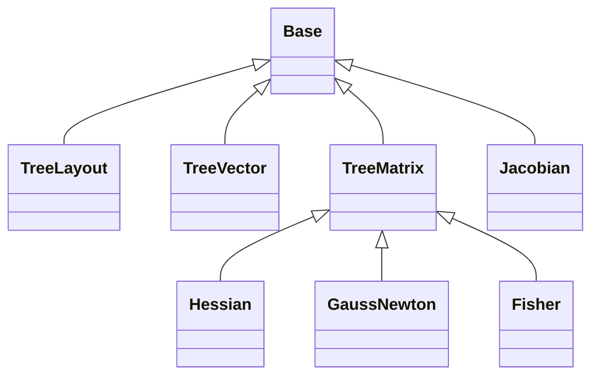

# Zodiax derivatives overview

Zodiax derivatives provides PyTree-aware Jacobian, exact Hessian, and
Gauss--Newton calculations. Differentiated parameter leaves are flattened into one
stable coordinate axis, while `TreeLayout` records how that axis maps back to model
paths and shapes.

The numerical results are returned as ordinary Equinox modules containing arrays
and static layout metadata. The differentiated function and temporary JAX
linearisation closures are consumed during calculation rather than stored. The
resulting derivative objects remain inspectable, serialisable, and compatible with
JAX transformations.

## 1. High-level operations

The three primary calculations differ by the contract of their first argument:

| Operation | Function output | Result |
|---|---|---|
| `jacobian(f, x)` | Floating array | Exact output Jacobian |
| `hessian(f, x)` | Floating scalar objective | Exact objective Hessian |
| `gauss_newton(residual_fn, x)` | Unreduced floating residual array | Gauss--Newton Hessian approximation |

```python
import jax.numpy as np
import zodiax as zdx

parameters = {
    "slope": np.array(1.2),
    "offset": np.array(-0.1),
}
coordinates = np.array([-1.0, 0.0, 1.0])
observations = np.array([-1.0, 0.2, 1.1])


def model(values):
    return values["slope"] * coordinates + values["offset"]


def residuals(values):
    return model(values) - observations


cov = np.diag(np.array([0.1, 0.2, 0.1]) ** 2)

J = zdx.jacobian(model, parameters)
G = zdx.gauss_newton(residuals, parameters, cov=cov)


def loss(values):
    residual = residuals(values)
    return 0.5 * residual @ np.linalg.solve(cov, residual)


H = zdx.hessian(loss, parameters)
```

`J`, `G`, and `H` share the parameter layout even though they represent different
derivative objects:

```text
J.matrix.shape == (3, 2)
G.matrix.shape == (2, 2)
H.matrix.shape == (2, 2)

J.layout.paths == ('offset', 'slope')
G.layout.paths == ('offset', 'slope')
H.layout.paths == ('offset', 'slope')
```

Plain dictionaries use JAX's canonical key order, not insertion order, so `offset`
precedes `slope` in this example.

## 2. Package structure

The public classes and operations are re-exported from `zodiax`, so normal use is
`zdx.TreeLayout`, `zdx.jacobian`, `zdx.hessian`, and `zdx.gauss_newton`.

```text
zodiax/derivatives/
├── overview.md
├── containers.py
│   ├── TreeLayout
│   ├── TreeVector
│   ├── TreeMatrix
│   ├── Jacobian
│   ├── Hessian
│   ├── GaussNewton
│   └── Fisher
└── operations.py
    ├── jacobian
    ├── hessian
    ├── gauss_newton
    └── hessian_to_pytree (deprecated)
```

The realised container hierarchy is deliberately small:



`TreeLayout` is shared metadata rather than a matrix superclass. A `Jacobian` has
arbitrary output axes and one parameter axis, whereas the `TreeMatrix` subclasses
have the same parameter layout on both square axes.

## 3. Parameter coordinates and `TreeLayout`

Derivative operations treat the complete second argument as the parameter PyTree.
Every leaf is included and must be floating and array-like. Integer, Boolean,
complex, key, string, or other fixed leaves should be captured by the differentiated
function or its surrounding model rather than included in `x`.

```python
tree = {
    "layer": {
        "weights": np.array([1.0, 2.0]),
        "bias": np.array(3.0),
    },
    "matrix": np.zeros((2, 2)),
}

layout = zdx.TreeLayout.from_tree(tree)
```

```text
layout.paths
# ('layer.bias', 'layer.weights', 'matrix')

layout.shapes
# ((), (2,), (2, 2))

layout.sizes
# (1, 2, 4)

layout.size
# 7
```

`paths`, `shapes`, and their implied slices define one stable flattened coordinate
axis. Dots separate structural path components, so literal dictionary keys that
contain dots are rejected.

The layout can flatten a matching tree and split it back into path-keyed leaves:

```python
flat = layout.flatten(tree)
leaves = layout.unflatten(flat)
nested = layout.unflatten(flat, nested=True)
```

`unflatten` reconstructs shaped dictionaries rather than the original model class.
The derivative operations separately retain JAX's `ravel_pytree` closure while they
are running so that each trial flat parameter vector can rebuild the original input
structure.

### Explicit layouts

`TreeLayout.from_paths` constructs a layout for an explicitly selected and ordered
set of paths:

```python
selected = zdx.TreeLayout.from_paths(
    tree,
    ("layer.weights", "layer.bias"),
)
```

This is useful when constructing containers manually. The current `jacobian`,
`hessian`, and `gauss_newton` operations do not accept a selected layout: they
differentiate every leaf in the supplied parameter PyTree.

Layout compatibility compares paths and shapes. Numerical values and dtypes belong
to the vectors and matrices rather than to the layout itself.

## 4. Realised derivative containers

### `TreeVector`

`TreeVector` associates a flat numerical vector with one layout:

```python
vector = zdx.TreeVector.from_tree(tree)

vector.vector
vector.flat_dict()
vector.nested_dict()
```

Matrix diagonals and parameter-axis norms return `TreeVector` objects, making it
possible to map those quantities back to named model leaves without carrying the
original model.

### `TreeMatrix`

`TreeMatrix` represents a square `(n, n)` matrix whose two axes share one layout:

```python
matrix = zdx.TreeMatrix(np.eye(layout.size), layout)

rows = matrix.rows()
columns = matrix.columns()
blocks = matrix.blocks()
diagonal = matrix.diagonal()
row_norms = matrix.row_norms()
column_norms = matrix.column_norms()
```

`blocks()` returns a path-keyed tree of parameter-pair blocks. If one parameter leaf
has shape `row_shape` and another has shape `column_shape`, their block has shape
`row_shape + column_shape`.

`Hessian`, `GaussNewton`, and `Fisher` are symmetric `TreeMatrix` subclasses. Their
constructors store `(matrix + matrix.T) / 2`, removing small antisymmetric numerical
differences and enforcing the container invariant. They do not project eigenvalues
or assert positive definiteness.

### `Jacobian`

A `Jacobian` preserves all output axes and appends one flattened parameter axis:

```text
jacobian.matrix.shape == f(x).shape + (jacobian.layout.size,)
```

```python
columns = J.columns()
output_norms = J.row_norms()
parameter_norms = J.column_norms()
```

`columns()` replaces the final flat parameter axis with named parameter leaves.
`row_norms()` reduces the parameter axis and retains the original output shape.
`column_norms()` reduces every output axis and returns a `TreeVector` over the
parameters.

## 5. Jacobians

`jacobian` accepts one floating array-valued function:

```python
J = zdx.jacobian(
    model,
    parameters,
    nbatches=1,
    jit=True,
    checkpoint=False,
)
```

With `nbatches=1`, Zodiax uses the direct JAX Jacobian path. With more blocks, it
linearises the function once and applies the resulting JVP to batches of parameter
basis vectors. Each application produces a block of Jacobian columns without
re-evaluating the primal model for every column.

The function output axes are never flattened in the returned `Jacobian`. Only the
input parameter coordinates are flattened.

## 6. Exact Hessians

`hessian` accepts one floating scalar objective and computes its exact second
derivative:

```python
H = zdx.hessian(
    loss,
    parameters,
    method="fwd-rev",
    nbatches=1,
    jit=True,
    checkpoint=False,
)
```

The result may be indefinite. Unlike Gauss--Newton, it includes every source of
curvature in the scalar objective: nonlinear residual curvature, priors,
regularisation, parameter-dependent weighting, and any other differentiable terms.

### Forward over reverse

`method="fwd-rev"` is the default. Conceptually, it calculates Hessian-vector
products as

```python
_, hvp = jax.linearize(jax.grad(loss), x)
column = hvp(direction)
```

Reverse mode first produces the gradient of the scalar objective. Forward mode then
linearises that gradient. For a batched Hessian, the gradient linearisation is
constructed once and reused across parameter directions. This is normally the most
efficient mixed-mode ordering for a scalar objective.

With `nbatches=1`, Zodiax uses `jax.hessian` directly. JAX's default Hessian
composition is also forward over reverse.

### Reverse over forward

`method="rev-fwd"` calculates the same exact product by reverse-differentiating a
scalar directional forward derivative:

```python
def directional(x):
    return jax.jvp(loss, (x,), (direction,))[1]


column = jax.grad(directional)(x)
```

Reverse mode now acts on the larger primal-and-tangent computation. This usually has
more execution and compilation overhead, and may repeat more work between parameter
blocks. It can still be useful when:

- a model provides especially efficient custom JVP rules;
- its memory or compilation behaviour favours the opposite nesting;
- one mixed-mode transformation fails while the other remains supported;
- or the two exact methods are being compared as a derivative cross-check.

`"rev-fwd"` requires forward-mode derivative rules. In particular, an operation
that provides only a custom VJP may not support this path.

The two methods differ in execution rather than mathematical accuracy. For a smooth
objective they calculate the same Hessian up to floating-point effects.

## 7. Gauss--Newton Hessian approximations

`gauss_newton` accepts a residual function rather than a scalar objective:

```python
G = zdx.gauss_newton(
    residuals,
    parameters,
    cov=cov,
    nbatches=1,
    jit=True,
    checkpoint=False,
)
```

For residuals $r(x) \in \mathbb{R}^m$, parameter coordinates
$x \in \mathbb{R}^n$, and covariance $C$, it computes

\[
G(x) = J_r(x)^\mathsf{T} C^{-1} J_r(x).
\]

Zodiax linearises the residual function once. Each matrix column is calculated as

```text
parameter direction v
        |
        | residual JVP
        v
      J v
        |
        | covariance weighting
        v
   C^-1 J v
        |
        | transposed residual linearisation
        v
 J.T C^-1 J v
```

The complete residual Jacobian is never materialised. The final dense `(n, n)`
Gauss--Newton matrix is still materialised and therefore still requires quadratic
parameter storage.

### Residuals are not scalar losses

`residual_fn(x)` must return the complete residual array before it is squared,
summed, averaged, or otherwise reduced:

```python
# Correct
def residual_fn(values):
    return model(values) - observations


G = zdx.gauss_newton(residual_fn, parameters, cov=cov)
```

Do not pass a reduced scalar objective:

```python
# Incorrect for gauss_newton
def scalar_loss(values):
    residual = residual_fn(values)
    return np.sum(residual**2)


G_wrong = zdx.gauss_newton(scalar_loss, parameters)
```

A scalar function is not rejected because a problem may genuinely contain one
scalar residual. Zodiax cannot determine whether a scalar output represents one
residual or an already reduced loss, so the semantic distinction is part of the
public function contract.

Passing the complete scalar loss to `hessian` is different: automatic
differentiation traces through the internal reduction and retains its complete
curvature. No residual information is lost merely because the final objective value
is scalar.

### What the approximation omits

For the constant-covariance weighted least-squares objective

\[
L(x) = \frac{1}{2}r(x)^\mathsf{T}C^{-1}r(x),
\]

the exact Hessian is

\[
\nabla^2L(x)
= J_r(x)^\mathsf{T}C^{-1}J_r(x)
+ \sum_i \left(C^{-1}r(x)\right)_i\nabla^2r_i(x).
\]

Gauss--Newton retains the first term and omits the residual-weighted second
derivatives. Zodiax does not calculate or optionally add this correction. If the
complete curvature is required, construct the scalar objective and pass it to
`hessian`.

Gauss--Newton is exact when the residual function is affine, because every residual
Hessian is zero. It also agrees with the exact weighted least-squares Hessian at a
zero-residual solution. It is often useful near a small-residual solution or where
the residual model is locally close to linear.

It can be misleading:

- far from the solution when residuals are large;
- for strongly nonlinear residual functions;
- when negative curvature is important;
- when covariance or other weighting depends on the parameters;
- for robust or non-quadratic objectives without a corresponding generalised
  Gauss--Newton derivation;
- or for arbitrary scalar objectives that have no exposed residual structure.

A positive-semidefinite residual weighting gives a positive-semidefinite
Gauss--Newton matrix. That property is often useful for optimisation, but it is also
evidence that the approximation cannot represent negative curvature in the exact
objective.

### Gauss--Newton is not generally Fisher information

The same numerical matrix can equal Fisher information under additional statistical
conditions, such as particular Gaussian likelihood models and the relevant
expectation over data. Those conditions are not implied merely by supplying a
residual function and covariance.

`gauss_newton` therefore returns a `GaussNewton`, not a `Fisher`. The separate
`Fisher` container and `Fisher.from_jacobian` constructor should be used only where
the statistical interpretation is established independently.

## 8. Covariance and inverse covariance

`cov` and `inv_cov` are alternative residual-space weighting inputs. They both have
shape `(m, m)`, where `m = residual_fn(x).size` after row-major flattening.

### Covariance input

```python
G = zdx.gauss_newton(
    residual_fn,
    parameters,
    cov=cov,
)
```

For every parameter block, Zodiax applies `C^-1` by solving against `cov`. All JVP
responses in that block are passed as multiple right-hand sides to the same solve.
This avoids constructing the complete inverse and is normally the more stable path
when a symmetric positive-definite covariance is available.

The cost includes a solve for each sequential parameter block. Smaller numbers of
larger blocks can therefore use dense linear algebra more efficiently.

### Precomputed inverse covariance

```python
G = zdx.gauss_newton(
    residual_fn,
    parameters,
    inv_cov=precision,
)
```

When `inv_cov` is already available, Zodiax applies it by matrix multiplication.
This avoids repeated covariance solves and can be substantially faster when the same
precision is reused at many parameter points.

Explicitly forming an inverse can lose numerical accuracy for an ill-conditioned
covariance and may perform unnecessary work when only inverse products are needed.
Prefer `inv_cov` when the precision is supplied naturally or has been calculated
once with an appropriate factorisation, rather than repeatedly inverting the
covariance inside an optimisation loop.

`cov` and `inv_cov` are mutually exclusive. Passing both raises. Omitting both
selects identity weighting:

```python
G = zdx.gauss_newton(residual_fn, parameters)
```

Both matrices are treated as constants with respect to `parameters`. A
parameter-dependent covariance contributes additional terms to an exact likelihood
Hessian and is outside this Gauss--Newton contract.

## 9. Batching and memory

All three derivative operations use the same `nbatches` interpretation: it is the
number of sequential parameter-column blocks, not the number of columns per block.

For `n` flattened parameters:

```text
block_size = ceil(n / nbatches)
```

The basis is padded to a fixed rectangular grid so every scanned block has the same
shape, then the padded columns are removed from the final result. `nbatches` must be
a positive integer no larger than `n`.

```python
J = zdx.jacobian(model, parameters, nbatches=2)
H = zdx.hessian(loss, parameters, nbatches=2)
G = zdx.gauss_newton(residual_fn, parameters, cov=cov, nbatches=2)
```

Increasing `nbatches` reduces the number of simultaneous tangent directions and
usually lowers temporary memory. It also increases sequential work and may reduce
accelerator throughput. The best value depends on the model, parameter count,
residual size, and device.

Batching does not reduce the storage of the returned dense matrix. Both exact
Hessians and Gauss--Newton matrices always contain `n * n` floating values. A future
matrix-free operator API would be needed for algorithms that should never
materialise that result.

The batching paths use `jax.lax.scan` so each fixed-shape block follows the same
compiled program.

## 10. JIT and checkpointing

`jit=True` compiles the inner flattened function and the reusable derivative product:

```python
H = zdx.hessian(loss, parameters, jit=True)
```

The returned container can cross an outer filtered-JIT boundary:

```python
import equinox as eqx

calculate = eqx.filter_jit(
    lambda values: zdx.hessian(loss, values, nbatches=2)
)
H = calculate(parameters)
```

`checkpoint=True` applies `jax.checkpoint` before differentiation:

```python
H = zdx.hessian(
    loss,
    parameters,
    nbatches=2,
    checkpoint=True,
)
```

Checkpointing asks JAX to rematerialise selected primal computations during reverse
differentiation instead of retaining all intermediates. It can lower peak memory at
the cost of extra computation. Its benefit depends on the differentiated program
and transform composition, so it should be benchmarked rather than assumed.

`nbatches` and `checkpoint` address different memory sources and may be used
together.

## 11. Mapping results back to parameter trees

Typed containers already know their parameter layout:

```python
parameter_columns = J.columns(nested=True)
hessian_blocks = H.blocks(nested=True)
gauss_newton_diagonal = G.diagonal().nested_dict()
```

`hessian_to_pytree` is deprecated as of version 0.5.0. It remains temporarily
available for legacy code that needs JAX's exact PyTree-of-PyTrees representation:

```python
tree_hessian = zdx.hessian_to_pytree(H, parameters)
```

For each pair of parameter leaves `i` and `j`, the legacy representation's block has
shape `shape_i + shape_j`. If a typed `Hessian` is supplied, its stored layout must
be compatible with the supplied parameter tree. A plain `(n, n)` array is validated
against the flattened parameter size.

New code should use `H.blocks(nested=True)`, which uses the layout already attached
to the result and avoids supplying the parameter tree again. To migrate code that
starts with a raw matrix, attach the layout explicitly:

```python
layout = zdx.TreeLayout.from_tree(parameters)
H = zdx.Hessian(hessian_matrix, layout)
hessian_blocks = H.blocks(nested=True)
```

## 12. Transformation and storage boundaries

The realised arrays inside `Jacobian`, `Hessian`, `GaussNewton`, and `Fisher` are
ordinary dynamic JAX leaves. Their `TreeLayout` metadata contains static paths and
shapes. This lets derivative values participate in filtered JIT, further automatic
differentiation, and Zodiax serialisation without retaining executable function
closures.

The derivative operations themselves consume:

- the callable being differentiated;
- the temporary `ravel_pytree` reconstruction closure;
- JVP, VJP, or Hessian-vector-product closures;
- and batching scan state.

None of those executable closures is placed in the returned object. Reusing a
realised derivative result therefore reuses its numerical matrix, not its original
linearisation. Call the derivative operation again when curvature at a new parameter
point is required.

## 13. Validation and common mistakes

### Fixed leaves in the parameter PyTree

Every leaf of `x` is a differentiation parameter and must be floating:

```python
# Invalid: the integer is part of the supplied parameter tree.
parameters = {
    "coefficient": np.array([1.0, 2.0]),
    "power": np.array(2, dtype=np.int32),
}
```

Capture fixed configuration outside the explicit parameter argument or construct a
parameter-only subtree.

### Wrong function output

- `jacobian` requires one floating array-like output.
- `hessian` requires one floating scalar output.
- `gauss_newton` requires one floating residual array, which may be scalar only when
  it genuinely represents one residual.

Complex outputs and complex parameter leaves are not part of the current contract.

### Mismatched residual weighting

For `m` flattened residual values, both `cov` and `inv_cov` must have shape `(m, m)`.
The residual array is flattened in row-major order, so the matrix ordering must match
that convention.

The `cov` path assumes an invertible covariance and should normally receive a
symmetric positive-definite matrix. `inv_cov` should normally be symmetric and
positive semidefinite. These value-level properties are documented contracts rather
than expensive runtime eigenvalue checks.

### Confusing exact and approximate curvature

`hessian` and `gauss_newton` can return matrices with the same shape and layout, but
they do not generally contain the same values. Use the concrete result type to
preserve that distinction in downstream code and serialised artifacts.

## 14. Choosing an operation

Use `jacobian` when:

- output sensitivities themselves are required;
- downstream code needs the complete derivative of an array-valued model;
- or an explicitly materialised `J` will be reused for several calculations.

Use `hessian` when:

- the natural input is a scalar objective;
- exact observed curvature is required;
- negative curvature matters;
- residual second derivatives should be retained;
- or covariance and other objective terms depend on the parameters.

Use `gauss_newton` when:

- the complete unreduced residual function is available;
- the local objective is constant-covariance weighted least squares;
- a positive-semidefinite curvature approximation is desirable;
- the residual model is locally linear or residuals are expected to be small;
- or materialising the residual Jacobian would use excessive memory.

Start exact Hessian calculations with `method="fwd-rev"`. Try `"rev-fwd"` when
model-specific performance, memory, or derivative-rule compatibility warrants it.
Start all operations with `nbatches=1`, then increase the number of blocks when peak
memory is excessive.
