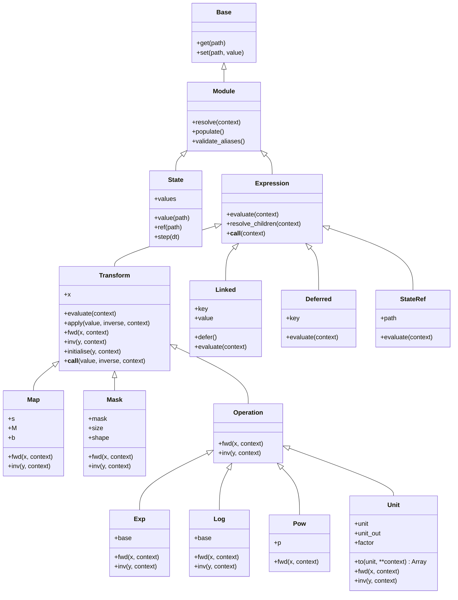

# Zodiax numerics overview

Zodiax numerics stores numerical definitions as Equinox PyTrees, with arrays
accessible through ordinary Zodiax paths and aliases.

## 1. Starting with a numerical definition

`Map` combines scaling, matrix multiplication, and bias in one definition.

```python
import jax
import jax.numpy as np
import jax.random as jr
import zodiax as zdx

mapping = zdx.Map(x=[1.0, 2.0], s=2.0, b=1.0)
print(mapping)
value = mapping.resolve()
print(value)
```

```text
Map(x=f32[2], s=f32[], b=f32[])
[3. 5.]
```

The stored input is `x`. Calling `mapping()` is equivalent to
`mapping.resolve()`. Leave `x` unspecified to supply an input later:

```python
operation = zdx.Map(s=2.0, b=1.0)
value = operation([1.0, 2.0])
same = operation.apply([1.0, 2.0])
```

Unit conversion is another numerical definition:

```python
distance = zdx.Unit(x=value, unit="mm")
print(distance)
distance_m = distance.resolve()
print(distance_m)
```

```text
Unit(x=f32[2], unit='mm')
[0.003 0.005]
```

`Unit` follows the active output convention when it is evaluated. These examples
use the startup default of metres for Cartesian quantities. The stored input remains
in millimetres; resolution returns its converted value.

## 2. Arrays and optional inputs

`as_array` converts numerical inputs while retaining definitions and optional values.

A Gaussian parameter model can accept numerical values or expressions for its
centre and width, with `mean=None` selecting a zero centre:

```python
class Gaussian(zdx.Module):
    mean: jax.Array | zdx.Expression | None
    scale: jax.Array | zdx.Expression

    def __init__(self, mean=None, scale=1.0):
        self.alias = None
        self.mean = zdx.as_array(mean)
        self.scale = zdx.as_array(scale)

    def __call__(self, x):
        x = zdx.as_array(x)
        centred = x if self.mean is None else x - self.mean
        return np.exp(-0.5 * (centred / self.scale) ** 2)


gaussian = Gaussian(mean=None, scale=1.0)
shifted = Gaussian(mean=zdx.Map(x=0.5, s=2.0), scale=1.0)
prepared_shifted = shifted.resolve()
print(gaussian)
print(shifted)
print(prepared_shifted)
print(prepared_shifted(np.array([0.0, 1.0, 2.0])))
```

```text
Gaussian(mean=None, scale=f32[])
Gaussian(mean=Map(x=f32[], s=f32[]), scale=f32[])
Gaussian(mean=f32[], scale=f32[])
[0.60653067 1.         0.60653067]
```

Numerical parameters become arrays, `None` remains `None`, and a Map remains an
Expression until resolution. The prepared Gaussian can then evaluate its profile
with a positive scale. Stored field hints describe these arrays and definitions;
constructor inputs may also be ordinary numerical scalars or sequences.

Transform inputs can also be explicitly optional:

```python
identity = zdx.Map(x=None, s=None, M=None, b=None)
print(identity)
print(identity.resolve())
print(identity.apply([1.0, 2.0]))
```

```text
Map()
Map()
[1. 2.]
```

This unbound identity remains a Map until an input is supplied. Request a numerical
type when the calculation needs one:

```python
integers = zdx.as_array([1, 2, 3])
floating = zdx.as_array(integers, dtype=float)
```

`float`, `int`, `complex`, and `bool` use JAX's configured default precision.
Without `dtype`, the inferred numerical type is retained. Trainable parameters
should use floating or complex arrays. A dtype request does not attach a future
conversion to a preserved Expression.

## 3. Composition and reverse application

Nested transforms apply operations in order and reverse them in the opposite order.

```python
latent = np.array([-1.0, 0.0, 1.0])
operation = zdx.Exp(x=zdx.Map(s=2.0, b=1.0))
print(operation)
value = operation.apply(latent)  # exp(2 * latent + 1)
recovered = operation.apply(value, inverse=True)
assert np.allclose(recovered, latent)
```

```text
Exp(x=Map(s=f32[], b=f32[]))
```

An explicit input enters the deepest Transform stored in `x` and works outwards.
It overrides any deepest stored value. With stored input instead, use resolution:

```python
definition = zdx.Exp(x=zdx.Map(x=latent, s=2.0, b=1.0))
value = definition.resolve()
```

`apply(value, inverse=True)` reverses the complete chain. Exp, Log, and Unit reverse
on their numerical domains. Pow is forward-only. Map uses a representative matrix
inverse where necessary, and Mask gathers selected values; a reverse need not recover
information discarded by the forward calculation.

Operation subclasses Exp, Log, Pow, and Unit follow ordinary JAX broadcasting.
Their output shape may expand. Elementwise reversal keeps that broadcasted shape
instead of reducing it to the original smaller input shape.

### 3.1. Matrices and sampled bases

`Map` applies input scale, matrix or basis contraction, then output bias.

```text
y = matmul(s * x, M) + b
```

```python
matrix = np.array([[1.0, 0.0], [0.0, 1.0], [1.0, 1.0]])
mapping = zdx.Map(x=latent, s=2.0, M=matrix, b=0.5)
print(mapping)
print(mapping.resolve())
```

```text
Map(x=f32[3], s=f32[], M=f32[3,2], b=f32[])
[0.5 2.5]
```

Omitting `s`, `M`, or `b` skips its operation. A two-dimensional `M` uses row-vector
`x @ M` semantics. More generally, `matmul` contracts `(*batch, n)` with
`(n, *output)` to produce `(*batch, *output)`. Map scale and bias may broadcast
without expanding the relevant input or output shape.

### 3.2. Masks

`Mask` scatters compact values into selected positions of a larger array.

```python
masked = zdx.Mask(x=[2.0, 5.0], mask=[True, False, True, False])
print(masked)
full = masked.resolve()
compact = masked.apply(full, inverse=True)
print(full)
print(compact)
```

```text
Mask(x=f32[2], mask=bool[4], size=2)
[2. 0. 5. 0.]
[2. 5.]
```

The final input axis has one value per true mask entry, in flattened order. The
output replaces that axis with `mask.shape`, retaining any leading batch axes.
Construct Mask before entering JIT so its selected count is known. The mask is a
dynamic boolean array; changing its values must preserve that count. When passed dynamically through JIT, forward and
reverse execution recompute indices with work proportional to the mask size.

## 4. Models and aliases

An ordinary Module groups definitions and returns a prepared copy of its own class.

```python
class Model(zdx.Module):
    output: jax.Array | zdx.Module


model = Model(
    output=zdx.Exp(x=latent),
    alias={"latent": "output.x"},
)
print(model)
updated = model.set(latent=np.array([-2.0, 0.0, 2.0]))
prepared_model = updated.resolve()
print(prepared_model)
```

```text
Model(alias=(('latent', 'output.x'),), output=Exp(x=f32[3]))
Model(alias=(('latent', 'output.x'),), output=f32[3])
```

Aliases name existing dynamic structural paths without duplicating parameter
leaves. Names cannot collide with declared attributes. A uniquely named descendant
field or alias can also be reached from its parent:

```python
outer = Model(output=model)
parameters = outer.latent
outer = outer.set(latent=np.array([0.0, 1.0, 2.0]))
```

The nearest match is used. Equal-depth ambiguity requires a qualified path. A local
field or alias takes precedence over descendant names.

`zdx.update` distributes updates across several Modules:

```python
parameters = {"latent": np.zeros(3)}
first, second = zdx.update(parameters, model, updated)
all_first, all_second = zdx.update(parameters, model, updated, mode="all")
```

Default `mode="first"` applies each path to its first matching object; `mode="all"`
applies it to every match. Results retain the input object order. `strict=True`
rejects paths matching no object; `strict=False` permits unused paths.

Aliases describe the definition's topology. Resolving `output=Exp(...)` to an array
removes `output.x`, so that latent alias no longer applies to the prepared copy.
Edit parameters on the definition; use `validate_aliases()` to check an updated
tree explicitly. Inherited `set` does not rerun constructor validation.

## 5. Partial resolution

An expression can prepare available children while waiting for a required input.

```python
definition = zdx.Map(x=zdx.StateRef("input"), s=zdx.Map(x=2.0, b=1.0))
prepared = definition.resolve()
print(prepared)

state = zdx.State(input=[0.0, 1.0, 2.0])
print(prepared.resolve(state=state))
```

```text
Map(x=StateRef(path='input'), s=f32[])
[0. 3. 6.]
```

The scale becomes `3.0` before state is available. The StateRef remains until
`state` supplies its value. Ordinary Modules prepare their fields in the same way
and can retain coordinate-dependent definitions for a later component call.

A prepared copy retains values already read from context. Resolve the original
definition again to read changing context; reuse a prepared copy when those values
should remain fixed. Resolution never mutates the original definition.

## 6. Shared definitions

Linked stores one shared value and Deferred references its owner elsewhere in the tree.

```python
class Measurements(zdx.Module):
    science: jax.Array | zdx.Expression
    reference: jax.Array | zdx.Expression


gain = zdx.Linked(2.0, key="gain")
measurements = Measurements(
    science=zdx.Map(x=3.0, s=gain),
    reference=zdx.Map(x=1.0, s=gain.defer()),
)
print(measurements)
prepared_measurements = measurements.resolve()
print(prepared_measurements)
```

```text
Measurements(
  science=Map(x=f32[], s=Linked(value=f32[], key='gain')),
  reference=Map(x=f32[], s=Deferred(key='gain'))
)
Measurements(science=f32[], reference=f32[])
```

`resolve()` collects all owners before replacing links, then evaluates expressions.
Put each owner in exactly one tree position and use `defer()` for additional uses.
Owners may contain arrays, expressions, or PyTrees. Containers retain their structure;
supply their numerical leaves as arrays.

Resolve inside differentiation so every use contributes to the original owner:

```python
def residual(model):
    prepared = model.resolve()
    return prepared.science - prepared.reference


gradient = jax.grad(residual)(measurements)
```

`populate()` is an advanced structural-only step. It connects links without
calculating expressions; `validate_links()` checks the same topology. Automatic
population covers the outer resolution tree. For explicit application with
references across fields, first resolve the unbound operator or its containing
model, then use that prepared operator. `populate=False` skips automatic population
when it has already been performed.

## 7. Running state

State stores current numerical arrays that model expressions read through StateRef.

```python
state = zdx.State(index=0, time=0.0, dt=0.1, key=jr.key(0))
scheduled = zdx.Map(x=state.ref("time"), s=2.0, b=1.0)
print(state)
print(scheduled)
print(scheduled.resolve(state=state))
next_state = state.step()
print(scheduled.resolve(state=next_state))
```

```text
State(values={'index': i32[], 'time': f32[], 'dt': f32[], 'key': key<fry>[]})
Map(x=StateRef(path='time'), s=f32[], b=f32[])
1.0
1.2
```

Construction converts each entry to one array, including numerical lists, tuples,
and integer indices. Expressions belong in the model. StateRef stores only a path;
without supplied state, it remains deferred. `validate_state(model, state)` checks
that referenced paths exist.

`step()` advances available index and time entries using their original values.
`step(dt=...)` uses a different interval for one transition without changing stored
`dt`. Keys and other entries remain unchanged; applications manage random streams.

```python
state = state.set(time=zdx.as_array(0.5))
time = state.value("time")
```

Inherited `set` does not convert replacements. Supply arrays and preserve their
shapes, dtypes, and tree structure for JAX loop carry. Qualified paths such as
`values.time` disambiguate names. Scalar integer arrays support dynamic element
indexing; dynamic slice starts require JAX's fixed-size slicing operations.

## 8. Unit conventions

Unit converts into the current global convention unless an output unit is explicitly fixed.

```python
distance = zdx.Unit(x=2.0, unit="mm")
distance_m = distance.resolve()
distance_um = distance.to("um")
print(distance)
print(distance_um)
```

```text
Unit(x=f32[], unit='mm')
2000.0
```

The input unit is stored in `unit`. The constructor's `to=` sets `unit_out`; its
default `None` follows global settings at evaluation. `distance.to(unit)` returns
the converted array without changing the definition. Pass `None` to convert into
the current global convention, even if the definition has an explicit target:

```python
previous_units = zdx.get_units()
following = zdx.Unit(x=2.0, unit="mm")
fixed = zdx.Unit(x=2.0, unit="mm", to="m")
zdx.set_units({"cartesian": "um", "angular": "mas"})
print(following.resolve())
print(fixed.resolve())
print(fixed.to(None))
zdx.set_units(previous_units)
```

```text
2000.0
0.002
2000.0
```

`to(unit, **context)` also resolves contextual inputs. It raises `ValueError` if
the stored input is absent or still needs context; a successful call returns an array.

Eager evaluation uses the current settings. JIT captures those settings when tracing;
changing them does not alter an already compiled calculation. Set the desired
convention before tracing, or retrace the calculation after changing it.

`set_units` replaces settings; omitted categories use built-in defaults. Both
settings functions return independent dictionaries. `unit_info` and `canonical_unit`
inspect spellings. `conversion_factor` and `convert` between explicit units are
independent of global settings. Cartesian units support reciprocals and nonzero
integer powers from -8 to 8. Conversion follows ordinary arithmetic and dtype promotion.

## 9. A Gaussian expression

A GaussianProfile represents a sampled value that waits for named coordinates.

```python
class GaussianProfile(zdx.Expression):
    scale: jax.Array | zdx.Expression

    def __init__(self, scale):
        self.alias = None
        self.scale = zdx.as_array(scale)

    def evaluate(self, *, coordinates, **context):
        scale = zdx.resolve(self.scale, **context)
        scaled = coordinates / scale
        return np.exp(-0.5 * scaled**2)


profile_definition = GaussianProfile(scale=zdx.Map(x=0.5, s=2.0))
prepared_profile = profile_definition.resolve()
print(profile_definition)
print(prepared_profile)
coordinates = np.array([-1.0, 0.0, 1.0])
profile = prepared_profile.resolve(coordinates=coordinates)
print(profile)
```

```text
GaussianProfile(scale=Map(x=f32[], s=f32[]))
GaussianProfile(scale=f32[])
[0.60653067 1.         0.60653067]
```

The earlier Gaussian Module grouped parameters for an ordinary function call.
GaussianProfile is an Expression because it represents the sampled array itself.
Its positive scalar `scale` can be an array or an Expression. The first resolution
prepares scale as `1.0`, retaining GaussianProfile because coordinates are missing.
`evaluate` resolves the operand it needs and calculates the sampled profile.
`coordinates` is required because it has no default after the single `*`;
`**context` forwards other named inputs to nested definitions.

## 10. Coefficients and a sampled basis

A basis expansion combines coefficients with basis arrays that may be generated later.

```python
class LinearBasis(zdx.Expression):
    def evaluate(self, *, basis_coordinates, **context):
        constant = np.ones_like(basis_coordinates)
        return np.stack([constant, basis_coordinates])


class BasisExpansion(zdx.Expression):
    coefficients: jax.Array | zdx.Expression
    basis: jax.Array | zdx.Expression

    def evaluate(self, **context):
        coefficients = zdx.resolve(self.coefficients, **context)
        basis = zdx.resolve(self.basis, **context)
        return zdx.matmul(coefficients, basis)


definition = BasisExpansion(
    coefficients=zdx.Map(x=[1.0, 2.0], s=2.0, b=1.0),
    basis=LinearBasis(),
)
prepared_basis = definition.resolve()
print(definition)
print(prepared_basis)
values = prepared_basis.resolve(basis_coordinates=coordinates)
print(values)
```

```text
BasisExpansion(
  coefficients=Map(x=f32[2], s=f32[], b=f32[]), basis=LinearBasis()
)
BasisExpansion(coefficients=f32[2], basis=LinearBasis())
[-2.  3.  8.]
```

Map coefficients become `[3, 5]` while LinearBasis waits for `basis_coordinates`.
Once sampled, its rows contain a constant and a linear coordinate; contraction
produces `3 + 5 * coordinates`. Either field can instead hold a prepared array.

Every context name must retain one scientific meaning throughout the tree. If a
parent derives `basis_coordinates` from incoming `coordinates`, it supplies the
derived value under the distinct name. Successive frames need distinct names;
the resolver does not infer scientific meaning from shapes.

## 11. Package structure and class hierarchy

The implementation separates array conversion, evaluation, mathematical operations, and context storage.

The surrounding model interface lives in `zodiax.module`: Module inherits the
general path operations in `zodiax.base.Base`. Equinox integration wrappers also
live in `zodiax.base`. Normal model code continues to use the top-level `zdx` imports.

```text
zodiax/numerics/
├── __init__.py       public exports
├── arrays.py         as_array
├── expressions.py    Expression, resolve
├── transforms.py     Transform, Map, Mask, matmul
├── operations.py     Operation, Exp, Log, Pow
├── units.py          Unit and unit settings/conversion functions
├── links.py          Linked, Deferred, populate, validate_links
├── state.py          State, StateRef, validate_state
└── overview.md       this tutorial
```

Classes inherit the methods shown on their parents. The diagram lists the main
public methods and fields; Module's path methods are inherited from Base.



## 12. Developer contracts

The following tables define input, output, and lifecycle behaviours for implementation and tests.

The corresponding tests live in `tests/numerics/`:

| Contract section | Test file |
|---|---|
| 12.1 Conversion boundaries | `test_arrays.py` |
| 12.2 Evaluation and context | `test_expressions.py` |
| 12.3 Transform mathematics, including Operations | `test_transforms.py` |
| 12.4 Ownership and population | `test_links.py` |
| 12.4 State and state references | `test_state.py` |
| 12.4 Unit conversion and conventions | `test_units.py` |

Module paths and aliases are covered separately in `tests/test_module.py` and
`tests/test_base_edge_cases.py`.

### 12.1. Conversion boundaries

Constructors normalise numerical values while preserving optional and deferred definitions.

| Input to `as_array` | Output type and shape | Contract |
|---|---|---|
| Python numerical scalar | Scalar JAX Array | Inferred numerical type, strong typing. |
| Numerical list/tuple, NumPy array, or JAX Array | JAX Array with input shape | Inferred dtype, subject to JAX configuration. |
| Numerical input with `dtype=float/int/complex/bool` | JAX Array with input shape | Requested numerical type at configured default precision. |
| `None`, with any dtype request | `None` | No value is introduced. |
| Expression, with any dtype request | The same Expression | No evaluation or future cast is attached. |

```python
pending = zdx.Map(x=[1, 2], s=2)
assert zdx.as_array(None, dtype=float) is None
assert zdx.as_array(pending, dtype=float) is pending
assert zdx.as_array([1, 2]).shape == (2,)
assert not zdx.as_array(1.0).weak_type
```

### 12.2. Evaluation and context

Resolution evaluates required operands and retains partial progress when a dependency is unavailable.

| Input or event | Output | Contract |
|---|---|---|
| Ordinary Module plus available context | Same Module class, prepared dynamic fields | Remaining local definitions are allowed. |
| Ready Expression plus required context | Its recursively resolved result | Numerical operands used by transforms produce scalars or arrays. |
| Expression missing required named context | Partially prepared Expression | Available children resolve; the owner remains. |
| Requested unresolved numerical operand | Partially prepared owning Expression | An unused Expression field does not block evaluation. |
| Nested request for an ordinary Module | Same Module class, possibly partial | The Module can supply local context later. |
| Ordinary calculation error or cycle | Exception | Only the dedicated incomplete-evaluation signal means deferral. |
| Context with a derived scientific input | Result using its explicitly named value | Each name has one meaning throughout the tree. |

```python
partial = GaussianProfile(scale=zdx.Map(x=0.5, s=2.0)).resolve()
assert isinstance(partial, GaussianProfile)
assert np.allclose(partial.scale, 1.0)
assert partial.resolve(coordinates=np.zeros(4)).shape == (4,)
```

`evaluate` is tried before child preparation when its required context exists.
Transform also checks required `fwd` arguments. The fallback forwards context
unchanged. Definitions remain pure; resolve the original again for changing context.

| Internal mechanism | Scope and result | Contract |
|---|---|---|
| Signature inspection | Required named arguments in `evaluate` or `fwd` | Positional `x` is accounted for; `**context` is not itself required. |
| Active-expression ContextVar | IDs within nested resolution | Detect cycles; restore the caller's state on success or failure. |
| Temporary result ContextVar | One outer resolution and one JAX trace | Reuse only identical expression/context objects; store no cache on the model. |

### 12.3. Transform mathematics

Explicit application follows the nested Transform chain, while subclass hooks perform one local calculation.

| API and input | Output type and shape | Contract |
|---|---|---|
| `transform()` with no explicit value | JAX Array or partially prepared Transform | Resolve stored input; `inverse=True` without a value raises `ValueError`. |
| `apply(value, inverse=False)`; numerical scalar/array-like or ready Expression | JAX Array at the chain's output shape | Explicit input replaces the deepest stored input; work outwards. |
| `apply(value, inverse=True)`; numerical output | JAX Array at a representative input shape | Reverse outermost to innermost with each local `inv`. |
| `inverse` flag: Python bool | Selected forward or reverse calculation | Keep the flag fixed during JAX tracing. |
| `fwd(x)` / `inv(y)`; prepared JAX Array | JAX Array | Local hooks resolve only stored operands they consume. |
| `Map`: `x` shape `(*batch, n)`, `M` shape `(n, *output)` | Array `(*batch, *output)` | Scale, contraction, bias; absent operands are identity. |
| Map scale/bias | Array retaining relevant shape | Broadcasting cannot expand that shape. |
| Map matrix reverse | Array `(*batch, n)`, minimum-norm at this stage | JAX pseudoinverse and rank cutoff; zero matrix gives zero. |
| Full Map reverse | Representative Array at the input shape | Undo bias, matrix, then nonzero scale; nonuniform scale means the full result need not be minimum-norm in original input coordinates. |
| Operation operands | Array with ordinary broadcast shape | Elementwise inverse retains expanded shape. |
| Mask forward: `x` shape `(*batch, size)` | Array `(*batch, *mask.shape)` | Construct before JIT; flattened selection order; unselected entries are zero. |
| Mask reverse: `y` shape `(*batch, *mask.shape)` | Array `(*batch, size)` | Gather selected values; mask updates retain static count. |
| Pow reverse | `NotImplementedError` | General powers have no selected inverse branch. |
| Optional `initialise(y)` construction helper | New Transform with recovered deepest `x` | Uses chain reverse; does not bind through a non-Transform Expression input. |

```python
scale = zdx.Map(s=2.0, b=1.0)
x = np.array([1.0, 2.0])
y = scale.apply(x)
assert np.allclose(y, np.array([3.0, 5.0]))
assert np.allclose(scale.apply(y, inverse=True), x)
assert masked.apply(full, inverse=True).shape == (2,)
```

Exp/Log bases are real, positive, and unequal to one; complex logarithms use the
principal branch. Numerical domains follow ordinary Python/JAX errors, infinities,
and NaNs. Inverse results are not cast back to an integer input dtype.

### 12.4. Ownership, state, units, and paths

Structural preparation and current-state updates have explicit boundaries independent of numerical formulas.

| API and input | Output | Contract |
|---|---|---|
| `populate(tree)` with Linked/Deferred nodes | Same outer tree with owned values substituted | Collect owners first; one owner per key; missing/duplicate owners and cycles raise. |
| `validate_links(tree)` | `None` or exception | Same topology checks without expression evaluation. |
| Outermost `resolve(tree)` | Populated and partially evaluated tree | Population defaults to true; use inside differentiation. |
| Explicit application with cross-field references | Array from a prepared operator | Populate the containing tree first; application alone does not collect its links. |
| `State` mapping/keyword numerical entries | State with one JAX Array per entry | Reject None and Expressions; keywords override mapping entries. |
| `StateRef(path)` plus State | Referenced numerical Array | Missing state defers; missing supplied-state path raises. |
| `State.step(dt)` | New State | Read original index/time; preserve `time.shape`; require index or time and a usable `dt` for time. |
| Inherited `State.set` | New State with requested replacements | No conversion; caller preserves loop structure, shapes, and dtypes. |
| `validate_state(model, state)` | `None` or exception | Check referenced paths without evaluating model expressions. |
| `Unit(x, unit)` with `unit_out=None` | Transform following global output units | Select the current convention at evaluation; preserve dimensional power. |
| `Unit(x, unit, to=target)` | Transform with explicit static `unit_out` | Keep this target regardless of global settings; require compatible category and power. |
| `Unit.to(unit: str \| None, **context)` with a ready stored input | JAX Array with the resolved input's shape | Convert into the requested unit, or current global convention for None; leave the original definition unchanged. |
| `Unit.to(...)` with no stored input or missing context | `ValueError` | The method promises an array; it does not return a deferred Unit. |
| Unit evaluated under JIT | Array using trace-time unit settings | Cached compiled calculations keep their traced convention. |
| `get_units` / `set_units` | Independent dictionary | Validate replacement before assignment; omitted categories use built-in defaults. |
| Module construction with mapping keys/aliases | Valid Module or exception | Mapping keys cannot contain dots; aliases target dynamic structural paths. |
| Module `set` / explicit alias validation | Updated Module / `None` or exception | Set does not repeat constructor checks; topology changes may invalidate aliases. |
| `zdx.update(parameters, *models)` | Tuple of updated Modules | First/all matching modes; strict rejects paths unused by every object. |

```python
snapshot = zdx.get_units()
snapshot["cartesian"] = "km"
assert zdx.get_units()["cartesian"] != "km"
zdx.validate_links(measurements)
zdx.validate_state(scheduled, state)

distance = zdx.Unit(x=zdx.StateRef("distance"), unit="mm", to="m")
converted = distance.to("um", state=zdx.State(distance=2.0))
assert isinstance(converted, jax.Array) and converted.shape == ()
assert np.allclose(converted, 2000.0)
assert isinstance(distance.x, zdx.StateRef) and distance.unit_out == "m"
```

### Alternative required inputs

Transform inherits Expression directly; application-specific base contracts belong
in the consuming library. An Expression normally declares required context in its
`evaluate` signature. When inputs are alternatives, such as a grid or explicit
coordinates, it may raise `zdx.Unresolved` if neither is supplied. Direct evaluation
raises this error; resolution retains the expression and prepares available children.
Ordinary calculation errors still propagate.
